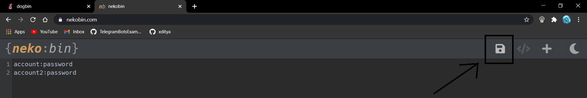
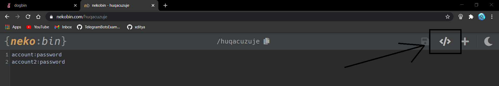

Adding Accounts.

i). Go to [DogBin](https://del.dog/) or [NekoBin](https://nekobin.com/).   
ii). Enter account details in the below format:   

account_user_id1:account_password1   
account_user_id2:account_password2   
.   
.   

Do not give any space in between and separate user id and password by :   

iii). Now click save.   
   

iv). Now click the raw button, looks like <>   
   

v). You will be redirected to another site. Copy its url and paste it in the var named `ACCOUNTS`.   